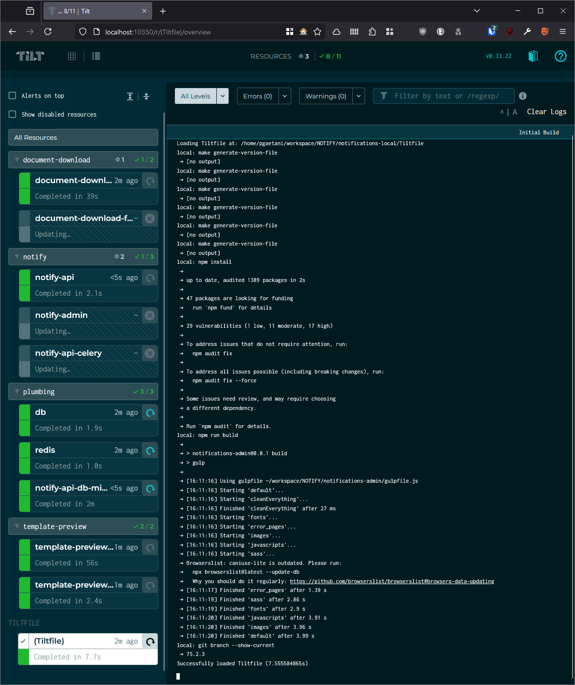

# The step-by-step

> [!IMPORTANT]  
> Current operating systems supported are ***MacOS, Ubuntu and Windows (using an Ubuntu WSL2)***.
> For all others, you are on your own (though you can always ask @pgaetani).

- [The step-by-step](#the-step-by-step)
  - [The Prerequirements](#the-prerequirements)
    - [Docker](#docker)
    - [OS package requirements](#os-package-requirements)
      - [Ubuntu](#ubuntu)
      - [MacOS](#macos)
    - [ASDF-VM](#asdf-vm)
      - [Installing the required tools via ASDF](#installing-the-required-tools-via-asdf)
    - [AWS](#aws)
    - [Git + SSH](#git--ssh)
  - [Notify setup](#notify-setup)
    - [Running the environment](#running-the-environment)
  - [Further reading](#further-reading)

## The Prerequirements

### Docker

[For most cases, Docker Desktop should do the job.](https://docs.docker.com/desktop/)

### OS package requirements

#### Ubuntu
```sh
sudo apt install build-essential curl git pass
```

#### MacOS

You will need [brew](https://brew.sh/).

```sh
brew install coreutils curl git pass
```

### ASDF-VM

This is a version manager for multiple languages and tools (like how NVM can manage multiple NodeJS versions). It is easier to deal with and can be cleaned up easily should a hard reset of the environment be required.

You may skip this step if you want to handle your own versions of things.

> [!TIP]
> Ubuntu uses ***bash*** and MacOS uses ***zsh***. Installing the completion scripts in the ASDF documentation could also be helpful if you're a heavy tab key user.

[Install docs](https://asdf-vm.com/guide/getting-started.html).

#### Installing the required tools via ASDF

```sh
for i in 'awscli azure-cli dotnet-core helm kubectl nodejs python tilt'; do
    asdf plugin add $i
done
```

```sh
for i in 'awscli azure-cli helm kubectl tilt' do
    asdf install $i latest
    asdf set --home $i latest
done
```

```sh
# In any folder where there is a .tool-versions file
cd /path/to/my/notifications-local
asdf install
```

| Tool        | Description 
| ----------- | ---
| awscli      | Command line client for AWS                           
| azure-cli   | Command line client for Azure
| dotnet-core | To build the OMC project
| helm        | For deployments to test/acc/prod
| kubectl     | For authentication to K8s clusters (required by Helm)
| nodejs      | To build the Notify Admin project
| python      | To build all Notify projects
| tilt        | To run the local environment

### AWS

You must be logged in to AWS to access the work queues, object storage and email service.

AWS-CLI must be installed (should have been done with the ASDF-VM step).

> [!IMPORTANT]  
> Ask @ernout-worth or @pgaetani for an AWS user, you should receive an email to finish the setup.

After that is done, the following commands must be run:

```sh
aws configure sso
```

This will ask for multiple things:

| Prompt | Answer
| ------ | ---
| SSO session name | worth-sso
| SSO start URL | https://d-996776e91a.awsapps.com/start
| SSO region | eu-central-1
| SSO registration scopes | sso:account:access

You can then login with the following command:

```sh
aws sso login
```

```sh
aws iam create-access-key <MYUSER>-pc
# e.g. my user is pgaetani
# aws iam create-access-key pgaetani-pc
```

Take note of the access key ID and secret.

### Git + SSH

[Follow the steps on GitHub](https://docs.github.com/en/authentication/connecting-to-github-with-ssh/generating-a-new-ssh-key-and-adding-it-to-the-ssh-agent?platform=linux) and ensure that you are able to clone repositories via SSH.

## Notify setup

From the `notifications-local` folder, run the environment variable script:

```sh
./generate-env-files.sh
```

And answer all the questions it asks. This should generate a `private` folder with multiple `.env` files.

### Running the environment

At this point it should be as simple as:

```sh
tilt up
```

Which should show a prompt like so:


You can then press the `Space` key to bring up the web interface. From here you are able to view logs for the build as well as the containers for the solution.



## Further reading

- [Still necessary steps after setup](temp.md)
- [VSCode setup](vscode.md)