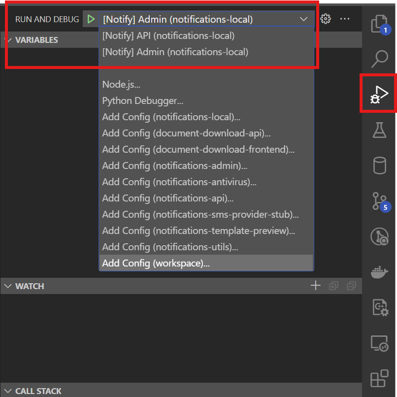

# VSCode

- [VSCode](#vscode)
  - [Installation](#installation)
  - [Recommended Extensions](#recommended-extensions)
  - [Setup](#setup)
  - [Debugging](#debugging)

## Installation

https://code.visualstudio.com/

## Recommended Extensions

- [ms-python.python](https://marketplace.visualstudio.com/items?itemName=ms-python.python)
> Python language support with extension access points for IntelliSense (Pylance), Debugging (Python Debugger), linting, formatting, refactoring, unit tests, and more.

- [ms-python.black-formatter](https://marketplace.visualstudio.com/items?itemName=ms-python.black-formatter)
> Formatting support for Python files using the Black formatter.

- [charliermarsh.ruff](https://marketplace.visualstudio.com/items?itemName=charliermarsh.ruff)
> A Visual Studio Code extension with support for the Ruff linter and formatter.

- [ms-azuretools.vscode-docker](https://marketplace.visualstudio.com/items?itemName=ms-azuretools.vscode-docker)
> Makes it easy to create, manage, and debug containerized applications.

- [eamodio.gitlens](https://marketplace.visualstudio.com/items?itemName=eamodio.gitlens)
> Supercharge Git within VS Code — Visualize code authorship at a glance via Git blame annotations and CodeLens, seamlessly navigate and explore Git repositories, gain valuable insights via rich visualizations and powerful comparison commands, and so much more

- [mtxr.sqltools](https://marketplace.visualstudio.com/items?itemName=mtxr.sqltools)
> Connecting users to many of the most commonly used databases. Welcome to database management done right.

- [mtxr.sqltools-driver-pg](https://marketplace.visualstudio.com/items?itemName=mtxr.sqltools-driver-pg)
> SQLTools PostgreSQL/Cockroach Driver

- [tilt-dev.tiltfile](https://marketplace.visualstudio.com/items?itemName=tilt-dev.Tiltfile)
> Provides an improved editing experience for `Tiltfile` authors.

## Setup

After the first `tilt up` run, all the needed repositories should be cloned. Ideally they should all be a part of a single VSCode workspace. In order to do that, each repository folder needs to be added separately to the workspace. Another way to do so would be to create a `notify.code-workspace` file in the parent folder to all the repositories with the following content:

```json
{
  "folders": [
    {
      "path": "notifications-local"
    },
    {
      "path": "document-download-api"
    },
    {
      "path": "document-download-frontend"
    },
    {
      "path": "notifications-admin"
    },
    {
      "path": "notifications-antivirus"
    },
    {
      "path": "notifications-api"
    },
    {
      "path": "notifications-sms-provider-stub"
    },
    {
      "path": "notifications-template-preview"
    },
    {
      "path": "notifications-utils"
    }
  ],
  "settings": {
    "debug.toolBarLocation": "commandCenter",
    "[python]": {
      "editor.defaultFormatter": "ms-python.black-formatter",
      "editor.formatOnSave": true
    },
    "python.analysis.typeCheckingMode": "basic",
    "git.enableCommitSigning": true,
    "makefile.configureOnOpen": false
  },
  "extensions": {
    "recommendations": [
      "ms-python.python",
      "ms-python.black-formatter",
      "charliermarsh.ruff",
      "ms-azuretools.vscode-docker",
      "eamodio.gitlens",
      "mtxr.sqltools",
      "mtxr.sqltools-driver-pg",
      "tilt-dev.tiltfile"
    ]
  }
}
```

Once saved, it should be possible to open the workspace file using VSCode.

## Debugging

Provided the Python extension is installed two debug configurations should be available from the `Run and Debug` menu within VSCode.

